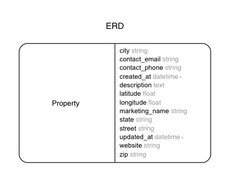

# Apts react on rails

## Environment / gems

- Ruby 2.3.1
- Rails 5.0.0
- Devise
- [React on Rails](shakacode/react_on_rails)
- etc


---

## Models



---

## Get started

```bash
rails db:create
rails db:migrate
rails db:seed
```

Start [react on rails](https://github.com/shakacode/react_on_rails#getting-started)


```yml
user:
  email:    "user@example.com"
  password: "password"
admin:
  email:    "admin@example.com"
  password: "password"
```
